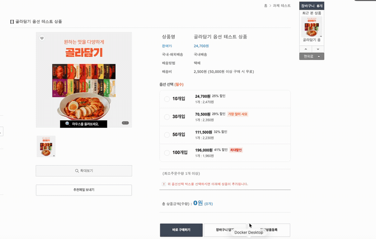
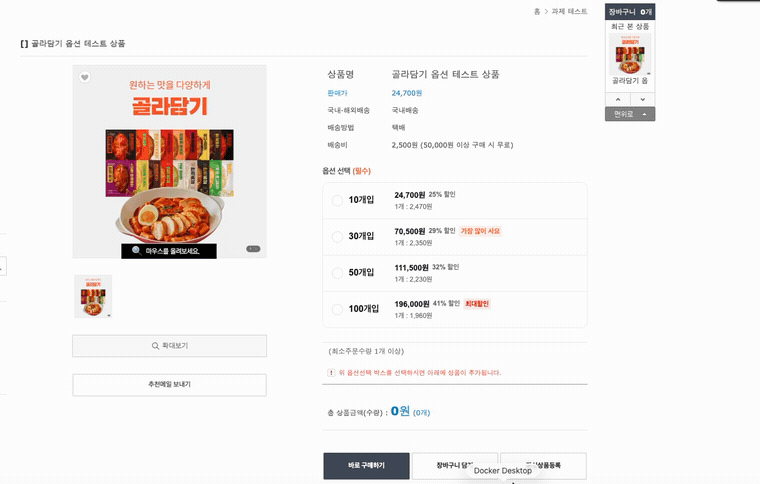
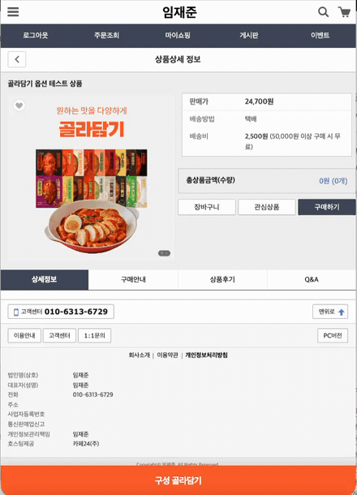

# 카페24 상품상세 "골라담기" 커스텀 옵션 UI

카페24 상품 상세페이지의 기본 구매 흐름(옵션 선택 · 선택상품 목록 · 장바구니 · 바로구매)을 그대로 유지하면서, 그 위에 "골라담기" 형태의 커스텀 옵션 UI를 얹은 구현입니다. 구매 · 금액 · 장바구니 로직은 재구현하지 않고 카페24 기본 로직을 그대로 사용합니다.

## 적용 URL

- PC — https://leemjaejun.cafe24.com/product/detail.html?product_no=11
- 모바일 — https://leemjaejun.cafe24.com/m/product/detail.html?product_no=11

시크릿 창(로그아웃 상태)으로 접속하면 실제 방문자 화면으로 확인할 수 있습니다.

---

## 핵심 설계 원칙 (과제 의도 우선)

과제는 "디자인 100% 재현보다 카페24 옵션 연동의 안정성을 우선한다" 고 명시합니다. 이 원칙에 따라 다음을 의식적으로 결정했습니다.

- **시안의 "맛 선택" 시트는 의도적으로 구현하지 않았습니다.**
  피그마 시안(한끼통살)은 `개입 선택 → 맛을 수량 스테퍼로 채우기` 의 2단계 구조지만, 표준 테스트 상품에는 맛 옵션이 존재하지 않습니다. 과제가 지정한 옵션값은 `10/30/50/100개입_1,_2` 뿐이며, suffix `_1,_2` 는 맛이 아니라 "같은 개입수의 추가 가능 횟수" 입니다. 즉 과제는 시안의 골라담기 개념을 `사이즈 선택 + 반복 추가 횟수` 로 재정의했습니다.
- **장식용 UI 대신 실제 연동에 집중했습니다.**
  존재하지 않는 맛 데이터로 UI를 만들면, 화려해 보여도 선택 결과가 실제 카페24 주문 · 품목에 반영되지 않는 장식용 UI가 됩니다. 이는 "실제 옵션 연동" 이라는 과제 핵심과 정반대입니다. 그래서 맛 시트 대신 8개 옵션의 연동 · 동기화 · 중복방지 · 횟수제한을 견고하게 만드는 데 집중했습니다. (개입 선택 카드의 시각 디자인 · 색 · 간격 · 뱃지는 시안 규격에 맞췄습니다.)
- **카페24 기본 구매 로직은 재구현하지 않습니다.**
  커스텀 UI는 기본 옵션을 대신 눌러주는 보조 레이어이며, 가격 · 수량 · 장바구니 · 바로구매는 전부 카페24 기본 로직이 처리합니다.

---

## 파일 구조 (카페24 스킨 경로와 1:1 대응)

| 파일 | 스킨 경로 | 역할 |
|---|---|---|
| `product/detail.html` | PC스킨 `/product/detail.html` | PC 상품상세. include + `#pickOptions` 마운트 |
| `mobile/product/detail.html` | 모바일스킨 `/product/detail.html` | 모바일 상품상세. 동일하게 마운트 |
| `css/pick-options.css` | 각 스킨 `/css/pick-options.css` | UI 스타일 (PC 인라인 카드 + 모바일 바텀시트) |
| `js/pick-options.config.js` | 각 스킨 `/js/pick-options.config.js` | 표시 데이터(가격 · 할인 · 뱃지 · 순서) |
| `js/pick-options.js` | 각 스킨 `/js/pick-options.js` | 동작 로직(동기화 · 중복방지 · 횟수제한 · 시트) |

`css` · `js` · `config` 3종은 PC · 모바일 스킨 공용입니다. 옵션 탐색 셀렉터를 특정 컨테이너(`.infoArea` 등)에 의존하지 않게 작성해, 두 스킨에 같은 파일을 올려도 동작합니다.

---

## 구현 하이라이트

- **양방향 동기화** — 별도 카운터에 의존하지 않고 카페24 선택상품 목록(`#totalProducts`)의 실제 DOM을 `MutationObserver`로 감시해 카드 상태를 재계산합니다. 카드로 담든, 목록에서 직접 삭제하든 항상 일치합니다.
- **연타 중복 방지** — 클릭 직후 `state.pending`(낙관적 잠금)에 등록해, 카페24 반영 전 같은 옵션이 두 번 담기는 것을 막습니다. 반영이 확인되거나 800ms 후 해제합니다.
- **비반응형 스킨 모바일 대응** — 베이직 스킨은 뷰포트 메타가 없어 CSS `@media`가 모바일에서 켜지지 않습니다. JS가 UA · `screen.width` · `innerWidth`로 모바일을 감지해 `body.pick-mobile`을 부여하고 하단 바텀시트를 노출합니다.
- **스킨 무관 셀렉터** — 세트/추가구성 옵션만 제외하는 방식으로 작성해 PC · 모바일 스킨에서 동일 파일이 동작합니다.
- **접근성** — `aria-pressed` · `aria-live` 상태 표기, `:focus-visible` 포커스 링, ESC로 시트 닫기 지원.

---

## 구현 방식

### ① 옵션 UI 구현

- 카페24 기본 텍스트버튼 옵션(옵션값 8개: `10/30/50/100개입_1,_2`)은 DOM에 그대로 유지합니다. (삭제 금지 — 구매 로직이 이 요소를 사용)
- 초기화 시 JS가 기본 옵션 버튼을 스캔(`findNativeOptionButtons`)해 `_숫자` suffix를 떼고 `10/30/50/100개입` 그룹으로 묶은 뒤(`groupNativeOptions`), `#pickOptionsList`에 그룹별 카드를 렌더링합니다.
- 카드 클릭 시 해당 그룹의 "아직 안 담긴 다음 옵션값"의 네이티브 옵션 요소를 프로그래밍 방식으로 `click` → 카페24 선택상품 목록(`#totalProducts`)에 품목이 추가됩니다.

### ② 외부 설정 JS 구조 (`pick-options.config.js`)

표시용 데이터(구매 로직과 무관)를 설정 파일 한 곳에 모아, 개발 지식 없이 값만 바꿔도 카드 표시가 바뀌도록 분리했습니다.

```js
window.PICK_OPTION_CONFIG = {
  optionSuffixPattern: /_(\d+)$/,   // 옵션값 끝 _1,_2 를 추가 가능 횟수로 해석
  groups: {
    '30개입': {
      price: '70,500원',        // 표시용 가격(문자열)
      discount: '29% 할인',     // 할인율 문구
      perUnit: '1개 : 2,350원', // 개당 가격
      badge: '가장 많이 사요',   // 뱃지 문구(없으면 미표시)
      badgeType: 'accent',      // 'accent'(주황) | 'max'(빨강)
      order: 2,                 // 카드 노출 순서
    },
    // 10 / 50 / 100개입 …
  },
};
```

`price` · `discount` · `perUnit` 은 화면 표시용 문자열이며, 실제 결제 금액은 카페24 옵션 · 장바구니 로직을 따릅니다. 뱃지 · 추천문구 · 노출순서 등 바뀔 수 있는 데이터는 전부 여기에만 두고, `pick-options.js`에는 동작 로직만 둡니다.

### ③ 카페24 옵션 동기화

- **동기화** — 선택상품 목록(`#totalProducts`)을 `MutationObserver`로 감시해, 담기/삭제 어느 쪽이든 카드 카운트 · 활성화 상태를 자동 갱신합니다.
- **중복 방지** — 클릭 직후 옵션을 낙관적 잠금에 등록해 연타 시 같은 옵션이 두 번 담기지 않게 합니다.
- **횟수 제한** — 옵션값 suffix(`_1`, `_2`) 개수가 그룹별 최대 추가 횟수입니다. (예: `30개입_1`, `30개입_2` → 최대 2회) 초과 클릭 시 담기지 않고 안내 메시지를 노출하며, 다 담은 카드는 `is-complete`로 표시합니다.
- **활성화 표시** — 담긴 카드는 액센트 테두리 · 배경 · 체크, `N / max` 카운트, `aria-pressed="true"`로 상태를 표시합니다.

### 모바일 처리 (바텀시트)

- 베이직 PC 스킨은 뷰포트 메타가 없는 비반응형 스킨이라 CSS `@media`가 모바일에서 켜지지 않습니다. 그래서 JS가 기기/화면폭으로 모바일을 감지해 `body.pick-mobile`을 부여하고, CSS가 그 클래스로 하단 바텀시트(고정 트리거 바 + 백드롭 + 시트 + 완료 버튼)를 켭니다.
- PC는 옵션 영역에 인라인 카드로, 모바일은 하단 고정 바를 탭하면 올라오는 바텀시트로 노출됩니다. 시트는 `position:fixed`라 터치 영역과 구매 버튼이 겹치지 않습니다.
- 실제 모바일 화면은 별도 모바일 전용 스킨(`/m/`)에 이식해, 반응형 레이아웃 + 바텀시트로 동작합니다.

---

## QA 결과

| # | 요구사항 | 결과 | 비고 |
|---|---|:---:|---|
| 1 | 골라담기 커스텀 옵션 UI 정상 노출 | ✅ | |
| 2 | 선택 시 기본 옵션 선택 상태 · 구매 흐름 동기화 | ✅ | 아래 GIF |
| 3 | 선택상품 목록 정상 생성, 반복 클릭 시 오류 · 중복 없음 | ✅ | 아래 통합 GIF |
| 4 | suffix(_1,_2) 기준 개입수별 추가 횟수 제한 | ✅ | 아래 통합 GIF |
| 5 | 개입 수별 금액 계산, 옵션값 8개 품목 모두 생성 | ✅ | 통합 GIF에서 4그룹 2/2 = 8품목 전부 생성 확인 |
| 6 | 수량 변경 · 총금액 · 장바구니 · 바로구매 정상 | ✅ | 카페24 기본 로직(미변경) 사용 |
| 7 | 선택 옵션 활성화 상태 명확히 표시 | ✅ | 아래 통합 GIF |
| 8 | 표시 데이터가 외부 설정 JS로 분리 | ✅ | `pick-options.config.js` |
| 9 | PC / 모바일 반응형 레이아웃 안 깨짐 | ✅ | 모바일 GIF · devtools 확인 |

### 동작 확인 녹화

**#2 — 옵션 선택 ↔ 선택상품 목록 동기화 (담기/삭제 양방향)**



**#3 · #4 · #7 — 중복 방지 · suffix 횟수 제한(초과 안내) · 활성화 상태 표시**

각 구성 `_1`, `_2`가 중복 없이 담기고(#3), 초과 클릭 시 "최대 N회" 안내가 노출되며(#4), 담긴 카드는 액센트 강조와 `N/max` 카운트로 상태를 표시합니다(#7).



**모바일 — 하단 트리거 바 → 바텀시트 → 카드 선택 (선택상품 목록 동기화)**



---

## 참고 · 제한 사항

- **시안의 "맛 선택" 시트 미구현** — 사유는 위 핵심 설계 원칙 참고 (표준 상품에 맛 옵션이 없어 과제 범위 밖, 장식용 UI 지양).
- **베이직 PC 스킨 비반응형** — PC 스킨을 모바일 폭에서 보면 페이지 전체가 축소돼 보입니다. 스킨 특성이며 "옵션 외 영역 수정 금지"로 과제 범위 밖입니다. 실제 모바일은 모바일 전용 스킨에 별도 이식해 정상 동작합니다.

## 개선 아이디어

- 카드에 옵션별 재고/품절 상태 연동 표시
- 모바일 바텀시트에 드래그(스와이프)로 닫기 제스처 추가

---

## 로컬 개발 · 배포

정적 파일이라 빌드가 없습니다.

```bash
node --check js/pick-options.js   # 문법 확인(선택)
```

배포는 카페24 편집창에서 `detail.html`(마운트)과 `css` · `js` 파일을 각 경로에 반영한 뒤, 저장 → 대표 디자인 설정 → 시크릿 창 강력 새로고침 순으로 진행합니다. PC · 모바일 두 스킨에 각각 반영하며, `css` · `js` · `config`는 동일 파일을 양쪽에 올립니다.

배포본은 아래로 검증할 수 있습니다.

```bash
curl -s https://leemjaejun.cafe24.com/js/pick-options.js  | diff - js/pick-options.js
curl -s https://leemjaejun.cafe24.com/css/pick-options.css | diff - css/pick-options.css
```
